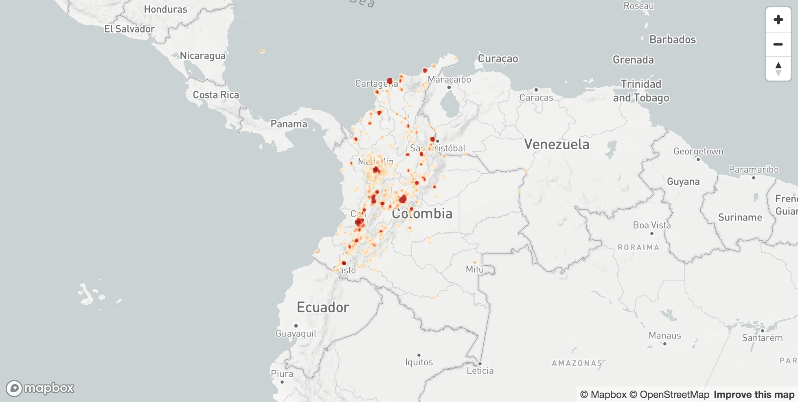

# MapboxGL in Jupyter Notebooks

Author: Arjan Geers (ajgeers@gmail.com)

Testing mapboxgl-jupyter by creating a map of health sites in Colombia.




## Python environment

```sh
conda env create -n mapboxgl-in-jupyter -f environment.yml
source activate mapboxgl-in-jupyter
```


## License

MIT
